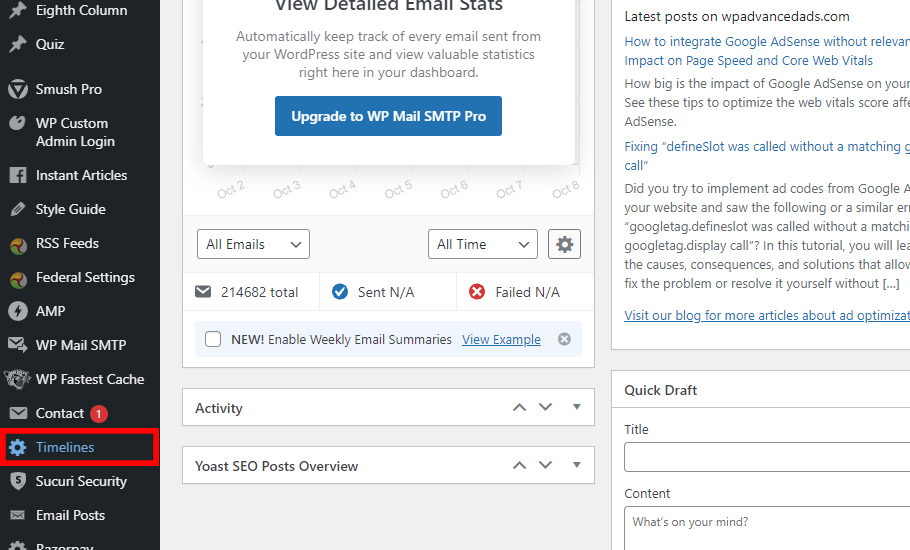
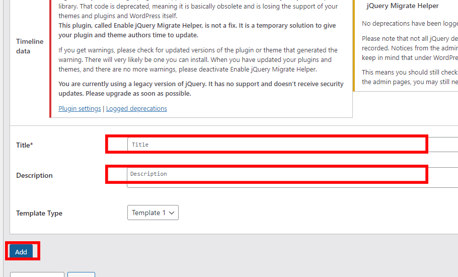
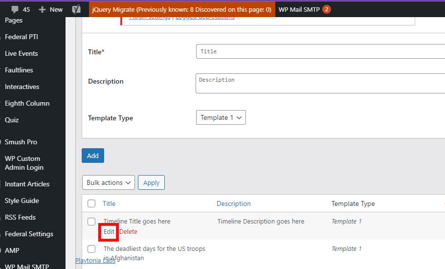
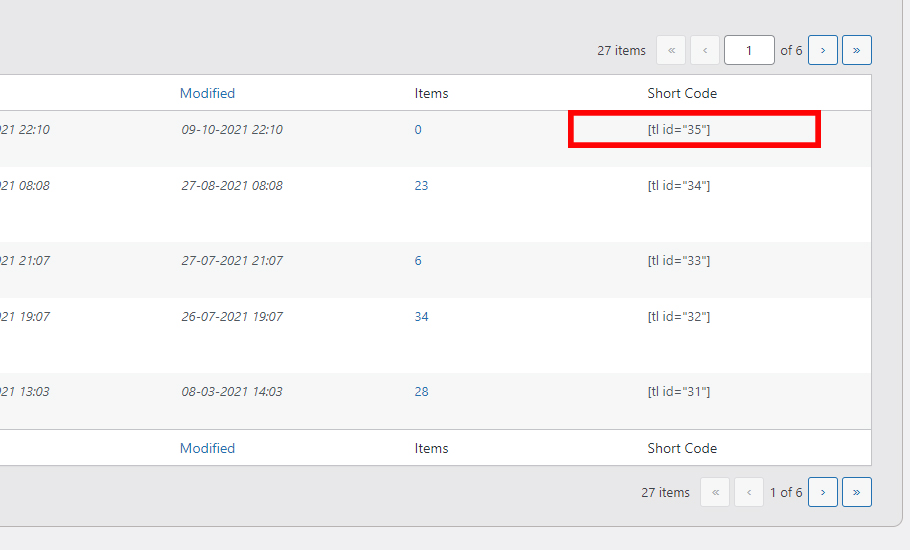
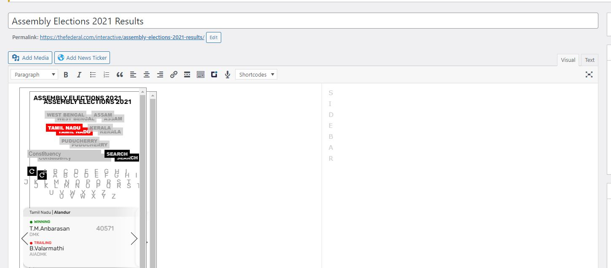
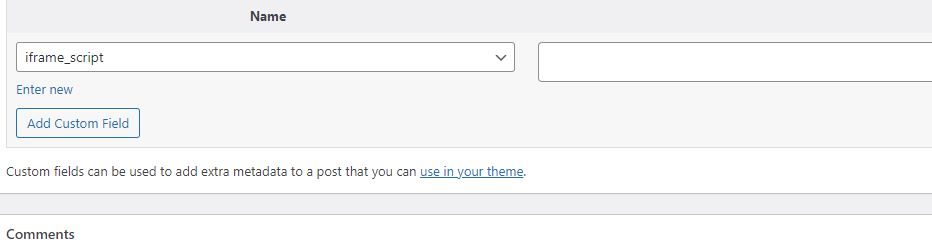
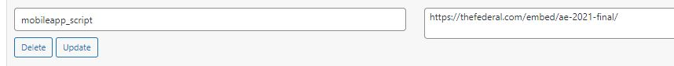

# documentation


### Responsive ShortCode

Desktop: 910px
Mobile: 400px

```
[SHOWIMAGE desktop="https://thefederal.com/wp-content/uploads/2019/08/festivals-01-1.jpg" mobile="https://thefederal.com/wp-content/uploads/2019/08/festivals-02-1.jpg"]  
```

<hr>

### Election Dashboard Resources

- [Geojson.io](https://geojson.io)
- [mapshaper](https://mapshaper.org/)
- [psleci.nic.in](http://psleci.nic.in/)
- [datameet](http://projects.datameet.org/maps/)
- [indiavotes](https://www..com/)
- [results.eci.gov.in](https://results.eci.gov.in/)
- [myneta.info](https://www.myneta.info/)

<hr>

### How to use Timeline Shortcode

Step 1: Click on timeline menu on side bar in the Dashboard


Step 2: Add Title and description of Timeline and click on add button


Step 3: In the list below find the added Timeline and click on edit


Step 4: Add Text or Date, Month, Year, image path(Optional), Description and click add button. Repeat step until all points are added


Step 5: Repeat Step 1 and find the list of said timeline get the shortcode to use in story



<hr>

### How are interactives setup in the Backend





