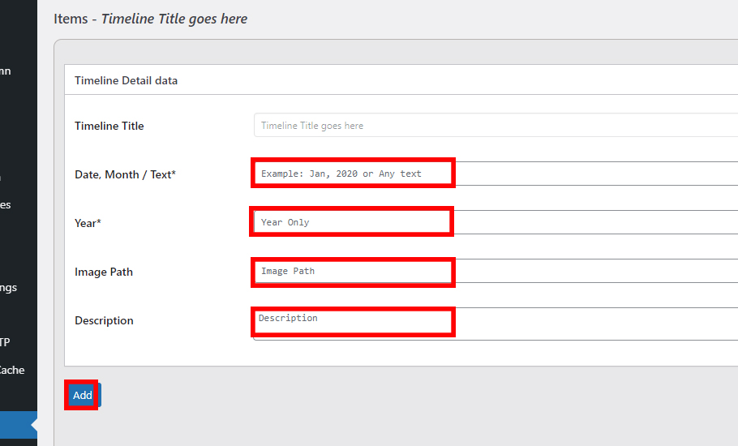

# documentation


### Responsive ShortCode

Desktop: 910px
Mobile: 400px

```
[SHOWIMAGE desktop="https://thefederal.com/wp-content/uploads/2019/08/festivals-01-1.jpg" mobile="https://thefederal.com/wp-content/uploads/2019/08/festivals-02-1.jpg"]  
```

<hr>

### Election Dashboard Resources

- [Geojson.io](https://geojson.io) - KML to Topojson
- [mapshaper](https://mapshaper.org/) - Shp file to Topojson
- [psleci.nic.in](http://psleci.nic.in/) - KML of Assembly Elections
- [datameet](http://projects.datameet.org/maps/) 
- [indiavotes](https://www..com/) - For Previous Data
- [results.eci.gov.in](https://results.eci.gov.in/)  - For Live Data
- [myneta.info](https://www.myneta.info/)  - ADR Data

<hr>

### How to use Timeline Shortcode

Step 1: Click on timeline menu on side bar in the Dashboard


Step 2: Add Title and description of Timeline and click on add button


Step 3: In the list below find the added Timeline and click on edit


Step 4: Add Text or Date, Month, Year, image path(Optional), Description and click add button. Repeat step until all points are added


Step 5: Repeat Step 1 and find the list of said timeline get the shortcode to use in story


<hr>

### How are interactives setup in the Backend (FYI only - Done by Developers)
Step 1: The Code is added on the backend in the cpanel in embed folder

Step 2: The Code is added to content area in Backend or iframe script custom field


Step 3: Add the copy from cpanel as url in mobile script to enable in mobile app


